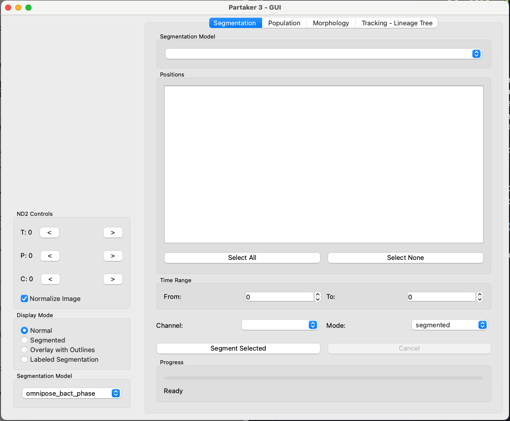
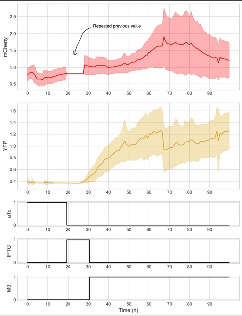

# Partaker

**Partaker** (Python-based Analyzer for Real-Time Assessment of Kinetics and Expression in Real-time) is a GUI application for single-cell bacterial image analysis in microfluidic time-lapse microscopy. It integrates deep learning segmentation, multi-channel fluorescence quantification with Relative Promoter Unit (RPU) calibration, and morphological analysis in a unified interface.

[](https://zenodo.org/records/18844425)



Partaker allows you to create plots like this:



## Features

- **Multi-model segmentation**: Six selectable deep learning models for cell segmentation
- **Multi-channel fluorescence**: Per-cell fluorescence quantification with background subtraction and RPU calibration
- **Morphological analysis**: Automated cell classification (rod, coccoid, artifact) with eight morphological descriptors
- **ND2 and TIFF support**: Native reading of Nikon ND2 files and standard TIFF stacks
- **Multi-file stitching**: Automatic concatenation of sequential acquisitions on the time axis
- **Session management**: Save and resume analysis sessions through HDF5

## Segmentation Models

Partaker integrates the following pretrained deep learning backends:

| Model | Family | Best For |
|-------|--------|----------|
| `omnipose_bact_phase` | Omnipose | Phase-contrast, dense monolayers |
| `omnipose_bact_fluo` | Omnipose | Fluorescence images |
| `bact_phase_cp3` | Cellpose 3 | Phase-contrast, general bacteria |
| `bact_fluor_cp3` | Cellpose 3 | Fluorescence images |
| `cellpose_deepbacs` | DeepBacs/Cellpose | Phase-contrast bacteria |
| `unet` | Custom U-Net | User-trained binary segmentation |

Users can compare model outputs on their data and select the best-performing model for their imaging conditions.

## Requirements

- Python >= 3.11, < 3.12
- One of the following supported platforms:
  - macOS on Apple Silicon (arm64)
  - Windows (x86_64)
  - Linux (x86_64 or aarch64) with glibc >= 2.28 (e.g. Ubuntu 20.04+, Debian 10+, RHEL/CentOS 8+)
- [uv](https://docs.astral.sh/uv/getting-started/installation/) package manager (recommended)

> **Unsupported configurations.** The following will not install and are not supported:
> - **Intel (x86_64) macOS**, because `torch` (>= 2.7) no longer ships macOS x86_64 wheels.
> - **Linux with glibc < 2.28** (e.g. RHEL/CentOS 7), because `pyside6` requires `manylinux_2_28`.
>
> Users on these systems should run Partaker on a supported platform (a recent Apple Silicon Mac, Windows, or a modern Linux distribution with glibc >= 2.28), or inside a container built on a supported base image.

## Installation

1. Install [uv](https://docs.astral.sh/uv/getting-started/installation/) if you do not have it:

```bash
curl -LsSf https://astral.sh/uv/install.sh | sh
```

2. Clone the repository:

```bash
git clone https://github.com/SamOliveiraLab/partaker.git
cd partaker
```

3. Launch Partaker:

```bash
uv run partaker_app
```

This will automatically download and install all dependencies and open the main GUI window.

## Quick Start

1. **Load data**: Go to `File > Open` and select your ND2 or TIFF file
2. **Navigate**: Use the T (time), P (position), and C (channel) sliders to browse your data
3. **Segment**: Select a segmentation model from the dropdown (e.g., `omnipose_bact_phase`) and switch Display Mode to "Labeled Segmentation" or "Overlay with Outlines"
4. **Batch segment**: Use the Segmentation tab on the right panel to select positions, time range, and model, then click "Segment Selected"
5. **Analyze fluorescence**: Switch to the Population tab to quantify fluorescence intensity per cell across channels
6. **Morphology**: Use the Morphology tab to extract cell shape descriptors and classify cell types

## Display Modes

- **Normal**: Raw microscopy image
- **Overlay with Outlines**: Segmentation contours overlaid on the original image
- **Labeled Segmentation**: Color-coded instance labels showing individual cells

## Custom U-Net Weights

To use a custom-trained U-Net model, set the environment variable before launching:

```bash
export PARTAKER_UNET_WEIGHTS="/path/to/your/unet_weights.pt"
uv run partaker_app
```

The weights file should be a PyTorch state-dict (`.pt`). A conversion script (`convert.py`) is provided for converting Keras `.h5` weights to PyTorch format.

## Example Dataset

The validation dataset used in the manuscript (two-strain E. coli co-culture in monolayer microfluidic chambers) is available on the BioImage Archive under accession S-BIAD3015.

## Dataset

The segmentation benchmark dataset (45 annotated phase-contrast frames with ground-truth instance masks across four chamber positions) and the custom U-Net training dataset (80 frames with binary and instance masks, boundary weight maps, and trained model weights) are archived on Zenodo, together with the benchmarking notebook used to compute the reported metrics:

https://doi.org/10.5281/zenodo.20577330

### Expected Outputs

Running the segmentation and analysis workflow on the example data produces:

- **Segmentation masks**: instance-labeled masks for each frame, viewable as "Labeled Segmentation" or "Overlay with Outlines"
- **Cell metrics CSV**: a per-cell, per-frame table containing morphological descriptors (area, perimeter, aspect ratio, solidity, and others) and per-channel fluorescence values
- **Fluorescence time series**: aggregated single-cell and population-level RPU traces synchronized with medium perturbations
- **Benchmark metrics CSV**: per-frame instance-level Jaccard Index, Dice coefficient, and mean IoU for each segmentation model (see the benchmarking notebook in the Zenodo deposit)

## Demo

A video walkthrough of Partaker is available on YouTube: [Partaker Demo](https://www.youtube.com/watch?v=7EISOG6SB8s)

## Documentation

Full documentation is available at: [https://samoliveiralab.github.io/partaker/](https://samoliveiralab.github.io/partaker/)

## Contributing

Contributions are welcome. Please use [conventional commits](https://www.conventionalcommits.org/en/v1.0.0/#summary) and contact the maintainers before starting major changes.