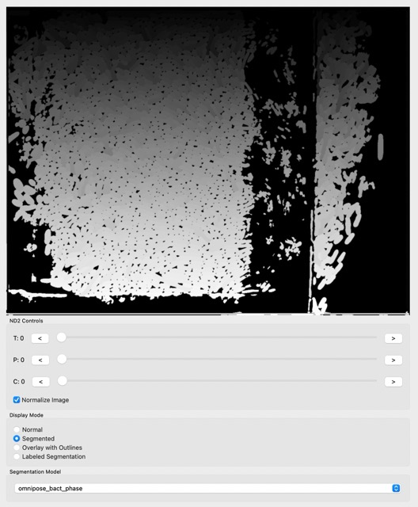

## Tutorial 0: Creating an experiment, previewing images, segmenting, saving and loading

Welcome to Partaker! If the installation process was successful, after starting the program with `uv run gui`,
you should see the following screen:

This is the main screen for Partaker, and you can get familiar with the main components, the image viewer, the ND2 controls, display mode and segmentation model on the left side.

ND2 controls:
- T: changes the time of the frame
- P: changes the position of the frame (different positions the microscope visited)
- C: changes the channel of the frame

Display mode:
- Normal: raw image
- Segmented: grayscale output of the segmentation model
- Overlay with outlines: the outlines for each cell
- Labeled segmentation: segmentaiton with perceptually diverging palette

Now, let's load our first data. For that, in the menu bar click File->Experiment. You should have the following window:

In the experimnt window, you insert the information for the experiment. Here we can insert the files and experiment name. Next, Partaker will load the files, and you should see a window like this one:

Let's try to use the segmentation feature on our cells. For that, click either Segmented or Labeled Segmentation, in Display mode. You can try and have images like this:

The segmentation looks nice, but there is some noise, especially in regions where there are no cells and the models get confused. Let's clean the image using Image->ROI from the menu bar:

Select at least 3 points, then complete polygon, then accept. You can see the result after selecting the ROI:

We can see that the result is much better than before.

We can now automatically segment large parts of our dataset in the right part of the Segmentation tab. You can select the positions and time range to be segmented, as well as the segmentation model, and Partaker will segment all the frames automatically. This is something that takes time depending on how many frames were selected for segmenting.

The segmentation takes a long time, and we don't want to redo work, so we can save and load our analysis in Partaker! Use File->Save in the menu bar, and create a new directory where you want to save you analysis. In a next moment, you can use File->Load when you start the program to load a previously done segmentation!

