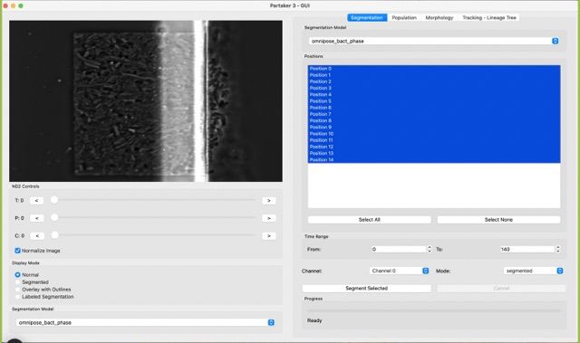

## Tutorial 1: Population dynamics analysis

Load an experiment by selecting experiment in File -> Experiment. Add the relevant ND2 files in order. Click on create experiment.

Now you should have something like this. If you scroll through the T slider, you should notice that the image is shaky. A shaky image is bad because it does not allow for proper ROI cropping.

The registration function tries to align images across the time series using the detected lines of the MC chambers. To use it, in the menu bar click on Image -> Registration, as in the next picture.

Depending on how large images and time series, a progress bar will appear in the terminal, such as this one:

The next step is the ROI selection, as we need to exclude some portions of the dataset that are noisy or irrelevant. In the same image menu as before, click on ROI. This window will pop up. Click on points on this image to select a polygon, then complete polygon to preview it, and then accept.

After accepting the ROI, the next segmentations will already look like the following image. Only cells that are completely within the ROI region will be considered for the segmentation and metric analysis.

If the segmentation result is satisfactory, you can move on to the automated segmentation mode, which is the right pane of the segmentation tab. 

What this program does is that, for each segmented cell it computes a series of morphological metrics, and it also overlaps this information with the fluorescence channels present in the dataset. So in the end we have a table like this:

| time | position | cell_id | size | main_axis_length | orientation | solidity | fluo_intensity | fluo_channel |
| ---- | -------- | ------- | ---- | ---------------- | ----------- | -------- | -------------- | ------------ |
|      |          |         |      |                  |             |          |                |              |
|      |          |         |      |                  |             |          |                |              |
|      |          |         |      |                  |             |          |                |              |

To get to this table, you can click Export DataFrame to CSV in the Population tab:

Now we have the resulting fluorescence analysis and we are ready to create some plots.
